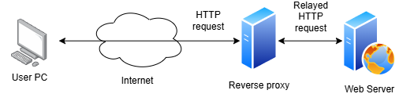
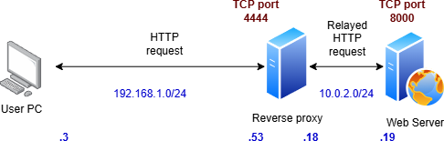
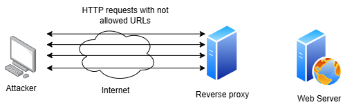
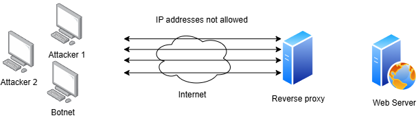

# Objective: To install a reverse proxy to protect a web server

Here is what you will learn:
- installing a reverse proxy (Caddy) on a Linux server
- filtering URLs so that unexpected traffic will not reach the web server
- filtering client IP addresses
- validating the protection of your web server investigating with tcpdump

# Why use a reverse proxy?

A reverse proxy is an intermediary server between a computer network and a server (most often a web server, but not exclusively). To do this, the reverse proxy creates two connections each time: one between itself and the web server, and another between itself and the remote equipment. Thus, during an attack targeting the web server, it is not the web server that is exposed, but rather the reverse proxy, which absorbs the attack instead.

A reverse proxy is useful for a web server because it improves:
- **Security**: HTTP requests do not go directly to the web server but are filtered by their URL beforehand (OSI layer 7 filtering). The reverse proxy can also block certain IP addresses, just like a firewall (OSI layer 3 filtering).
- **Performance**: The web server isn't overloaded with unnecessary or malicious requests.

Here is the commun usage of a reverse proxy portecting a web server:



# Lab architecture

The lab will use VMs. The reverse proxy will use TCP port 4444 to requests from clients whereas the web server will use a TCP port 8000 for HTTP request.

The architecture and the IP addresses of the test lab will be as follow:




# 1 - Installing Caddy on a Ubuntu server

We install the reverse proxy server called Caddy on a Ubuntu server equipped with 2 separate network interfaces. I chose this software since it is very simple to configure. Its documentation can be found at https://caddyserver.com/docs/install.

Following commands are to copy paste to the bash interpreter of the Ubuntu server:
 
```
sudo apt install -y debian-keyring debian-archive-keyring apt-transport-https curl
curl -1sLf 'https://dl.cloudsmith.io/public/caddy/stable/gpg.key' | sudo gpg --dearmor -o /usr/share/keyrings/caddy-stable-archive-keyring.gpg
curl -1sLf 'https://dl.cloudsmith.io/public/caddy/stable/debian.deb.txt' | sudo tee /etc/apt/sources.list.d/caddy-stable.list
chmod o+r /usr/share/keyrings/caddy-stable-archive-keyring.gpg
chmod o+r /etc/apt/sources.list.d/caddy-stable.list
sudo apt update
sudo apt install caddy
```

# 2 - Checking the Caddy server parameters 

We check now the network parameters of the proxy server and we ping the web server from the proxy server to check connectivity.

```
ip a
ip r
ping 10.0.2.19 -c 2
```

``` bash
tcm@server:~$ ip a
1: lo: <LOOPBACK,UP,LOWER_UP> mtu 65536 qdisc noqueue state UNKNOWN group default qlen 1000
    link/loopback 00:00:00:00:00:00 brd 00:00:00:00:00:00
    inet 127.0.0.1/8 scope host lo
       valid_lft forever preferred_lft forever
    inet6 ::1/128 scope host noprefixroute 
       valid_lft forever preferred_lft forever
2: enp0s3: <BROADCAST,MULTICAST,UP,LOWER_UP> mtu 1500 qdisc fq_codel state UP group default qlen 1000
    link/ether 08:00:27:a1:7b:46 brd ff:ff:ff:ff:ff:ff
    inet 192.168.1.53/24 brd 192.168.1.255 scope global dynamic noprefixroute enp0s3
       valid_lft 85880sec preferred_lft 85880sec
    inet6 fe80::e124:cda3:20bc:76e2/64 scope link noprefixroute 
       valid_lft forever preferred_lft forever
3: enp0s8: <BROADCAST,MULTICAST,UP,LOWER_UP> mtu 1500 qdisc fq_codel state UP group default qlen 1000
    link/ether 08:00:27:0f:40:53 brd ff:ff:ff:ff:ff:ff
    inet 10.0.2.18/24 brd 10.0.2.255 scope global dynamic noprefixroute enp0s8
       valid_lft 379sec preferred_lft 379sec
    inet6 fe80::a00:27ff:fe0f:4053/64 scope link 
       valid_lft forever preferred_lft forever
tcm@server:~$ ip r
default via 192.168.1.1 dev enp0s3 proto dhcp src 192.168.1.53 metric 100 
default via 10.0.2.1 dev enp0s8 proto dhcp src 10.0.2.18 metric 101 
10.0.2.0/24 dev enp0s8 proto kernel scope link src 10.0.2.18 metric 101 
192.168.1.0/24 dev enp0s3 proto kernel scope link src 192.168.1.53 metric 100 
tcm@server:~$ ping 10.0.2.19 -c 2
PING 10.0.2.19 (10.0.2.19) 56(84) bytes of data.
64 bytes from 10.0.2.19: icmp_seq=1 ttl=64 time=0.248 ms
64 bytes from 10.0.2.19: icmp_seq=2 ttl=64 time=0.242 ms

--- 10.0.2.19 ping statistics ---
2 packets transmitted, 2 received, 0% packet loss, time 1064ms
rtt min/avg/max/mdev = 0.242/0.245/0.248/0.003 ms
tcm@server:~$
```

-> There are 2 interfaces (enp0s3 for 192.168.1.0/24 and enp0s8 for 10.0.2.0/24) and ping to web server is OK.

# 3 - Checking Caddy is running

We check here the proxy server status and its configuration. Please note that the server is not configured to run as a reverse proxy yet.

```
sudo systemctl status caddy
curl -I http://localhost
cat /etc/caddy/Caddyfile
```

``` bash
tcm@server:~$ sudo systemctl status caddy
● caddy.service - Caddy
     Loaded: loaded (/usr/lib/systemd/system/caddy.service; enabled; preset: enabled)
     Active: active (running) since Sat 2026-02-21 15:16:40 CET; 16min ago
       Docs: https://caddyserver.com/docs/
    Process: 3388 ExecReload=/usr/bin/caddy reload --config /etc/caddy/Caddyfile --force (code=exited, status=0/SUCCESS)
   Main PID: 1222 (caddy)
      Tasks: 8 (limit: 4601)
     Memory: 53.7M (peak: 65.1M)
        CPU: 541ms
     CGroup: /system.slice/caddy.service
             └─1222 /usr/bin/caddy run --environ --config /etc/caddy/Caddyfile

févr. 21 15:33:13 server caddy[1222]: {"level":"info","ts":1771684393.480896,"logger":"admin","msg":"admin endpoint started","addres>
févr. 21 15:33:13 server caddy[1222]: {"level":"warn","ts":1771684393.481196,"logger":"http.auto_https","msg":"server is listening o>
févr. 21 15:33:13 server caddy[1222]: {"level":"warn","ts":1771684393.481509,"logger":"http","msg":"HTTP/2 skipped because it requir>
févr. 21 15:33:13 server caddy[1222]: {"level":"warn","ts":1771684393.4815176,"logger":"http","msg":"HTTP/3 skipped because it requi>
févr. 21 15:33:13 server caddy[1222]: {"level":"info","ts":1771684393.48152,"logger":"http.log","msg":"server running","name":"srv0">
févr. 21 15:33:13 server caddy[1222]: {"level":"info","ts":1771684393.4818118,"logger":"http","msg":"servers shutting down with eter>
févr. 21 15:33:13 server caddy[1222]: {"level":"info","ts":1771684393.4819834,"msg":"autosaved config (load with --resume flag)","fi>
févr. 21 15:33:13 server caddy[1222]: {"level":"info","ts":1771684393.482436,"logger":"admin.api","msg":"load complete"}
févr. 21 15:33:13 server systemd[1]: Reloaded caddy.service - Caddy.
févr. 21 15:33:13 server caddy[1222]: {"level":"info","ts":1771684393.4848797,"logger":"admin","msg":"stopped previous server","addr>
tcm@server:~$ curl -I http://localhost
HTTP/1.1 200 OK
Accept-Ranges: bytes
Content-Length: 18753
Content-Type: text/html; charset=utf-8
Etag: "dc9ffyxpf6yoegx"
Last-Modified: Sat, 23 Aug 2025 01:47:39 GMT
Server: Caddy
Vary: Accept-Encoding
Date: Sat, 21 Feb 2026 14:33:32 GMT

tcm@server:~$ cat /etc/caddy/Caddyfile
# The Caddyfile is an easy way to configure your Caddy web server.
#
# Unless the file starts with a global options block, the first
# uncommented line is always the address of your site.
#
# To use your own domain name (with automatic HTTPS), first make
# sure your domain's A/AAAA DNS records are properly pointed to
# this machine's public IP, then replace ":80" below with your
# domain name.

:80 {
	# Set this path to your site's directory.
	root * /usr/share/caddy

	# Enable the static file server.
	file_server

	# Another common task is to set up a reverse proxy:
	# reverse_proxy localhost:8080

	# Or serve a PHP site through php-fpm:
	# php_fastcgi localhost:9000
}

# Refer to the Caddy docs for more information:
# https://caddyserver.com/docs/caddyfile
tcm@server:~$ 
```

-> Proxy server is running ("active (running)") but the default configuration must be modified since it is configured as a web server.

# 4 - Configuring Caddy as a reverse proxy

We configure Caddy as a reverse proxy now. To do so we modify the configuration file which is /etc/caddy/Caddyfile. In the configuration bellow ":4444" is the local host TCP port used by the reverse proxy to accept requests from clients. "10.0.2.19:8000" specifies the IP address and the TCP port used by the web server that the reverse proxy will redirect to (if allowed). Look at how simple is this configuration.

```
sudo cp /etc/caddy/Caddyfile /etc/caddy/Caddyfile.bak
sudo nano /etc/caddy/Caddyfile
```

``` bash
tcm@server:~$ sudo nano /etc/caddy/Caddyfile
tcm@server:~$ ll /etc/caddy
total 24
drwxr-xr-x   2 root root  4096 févr. 21 15:41 ./
drwxr-xr-x 140 root root 12288 févr. 20 20:22 ../
-rw-r--r--   1 root root    36 févr. 21 15:41 Caddyfile
-rw-r--r--   1 root root   769 févr. 21 15:40 Caddyfile.bak
tcm@server:~$ cat /etc/caddy/Caddyfile
:4444

reverse_proxy 10.0.2.19:8000
tcm@server:~$
```

Configuration of /etc/caddy/Caddyfile:

```
:4444 {
	reverse_proxy 10.0.2.19:8000
}
```

# 5 - Restarting Caddy configuration to apply it

Then we restart the reverse proxy (which is a Linux daemon/service by the way) to apply the configuration and we check the TCP port is listening.

```
sudo systemctl reload caddy
sudo systemctl status caddy
netstat -aunt | grep 4444
```

``` bash
tcm@server:~$ sudo systemctl reload caddy
tcm@server:~$ sudo systemctl status caddy
● caddy.service - Caddy
     Loaded: loaded (/usr/lib/systemd/system/caddy.service; enabled; preset: enabled)
     Active: active (running) since Sat 2026-02-21 15:16:40 CET; 28min ago
       Docs: https://caddyserver.com/docs/
    Process: 4500 ExecReload=/usr/bin/caddy reload --config /etc/caddy/Caddyfile --force (code=exited, status=0/SUCCESS)
   Main PID: 1222 (caddy)
      Tasks: 8 (limit: 4601)
     Memory: 53.9M (peak: 65.1M)
        CPU: 621ms
     CGroup: /system.slice/caddy.service
             └─1222 /usr/bin/caddy run --environ --config /etc/caddy/Caddyfile

févr. 21 15:45:01 server caddy[1222]: {"level":"info","ts":1771685101.4088528,"logger":"admin.api","msg":"received request","method">
févr. 21 15:45:01 server caddy[1222]: {"level":"info","ts":1771685101.4099412,"logger":"admin","msg":"admin endpoint started","addre>
févr. 21 15:45:01 server caddy[1222]: {"level":"warn","ts":1771685101.4100974,"logger":"http","msg":"HTTP/2 skipped because it requi>
févr. 21 15:45:01 server caddy[1222]: {"level":"warn","ts":1771685101.410127,"logger":"http","msg":"HTTP/3 skipped because it requir>
févr. 21 15:45:01 server caddy[1222]: {"level":"info","ts":1771685101.4101336,"logger":"http.log","msg":"server running","name":"srv>
févr. 21 15:45:01 server caddy[1222]: {"level":"info","ts":1771685101.410162,"logger":"http","msg":"servers shutting down with etern>
févr. 21 15:45:01 server caddy[1222]: {"level":"info","ts":1771685101.4107916,"msg":"autosaved config (load with --resume flag)","fi>
févr. 21 15:45:01 server caddy[1222]: {"level":"info","ts":1771685101.4112096,"logger":"admin.api","msg":"load complete"}
févr. 21 15:45:01 server systemd[1]: Reloaded caddy.service - Caddy.
févr. 21 15:45:01 server caddy[1222]: {"level":"info","ts":1771685101.4141378,"logger":"admin","msg":"stopped previous server","addr>
tcm@server:~$ netstat -aunt | grep 4444
tcp6       0      0 :::4444                 :::*                    LISTEN     
tcm@server:~$
```

-> LISTEN state on TCP port 4444: the reverse proxy is running on the correct port. That's good.

# 6 - Running the web server on the other server

The web server will be a very simple one made with python. It does not need to be complicated for this lab. Feel free to change for another if you want (nginx, apache, a second Caddy, etc.).

```
python3 -m http.server
```

``` bash
ice@iceberg:~$ ip a
1: lo: <LOOPBACK,UP,LOWER_UP> mtu 65536 qdisc noqueue state UNKNOWN group default qlen 1000
    link/loopback 00:00:00:00:00:00 brd 00:00:00:00:00:00
    inet 127.0.0.1/8 scope host lo
       valid_lft forever preferred_lft forever
    inet6 ::1/128 scope host noprefixroute 
       valid_lft forever preferred_lft forever
2: enp0s8: <BROADCAST,MULTICAST,UP,LOWER_UP> mtu 1500 qdisc fq_codel state UP group default qlen 1000
    link/ether 08:00:27:f3:c0:40 brd ff:ff:ff:ff:ff:ff
    inet 10.0.2.19/24 brd 10.0.2.255 scope global dynamic noprefixroute enp0s8
       valid_lft 374sec preferred_lft 374sec
    inet6 fe80::bd67:f905:af33:3457/64 scope link noprefixroute 
       valid_lft forever preferred_lft forever
3: docker0: <NO-CARRIER,BROADCAST,MULTICAST,UP> mtu 1500 qdisc noqueue state DOWN group default 
    link/ether 82:4f:a1:17:06:76 brd ff:ff:ff:ff:ff:ff
    inet 172.17.0.1/16 brd 172.17.255.255 scope global docker0
       valid_lft forever preferred_lft forever
ice@iceberg:~$ ip r
default via 10.0.2.1 dev enp0s8 proto dhcp src 10.0.2.19 metric 100 
10.0.2.0/24 dev enp0s8 proto kernel scope link src 10.0.2.19 metric 100 
172.17.0.0/16 dev docker0 proto kernel scope link src 172.17.0.1 linkdown 
ice@iceberg:~$ python3 -m http.server
Serving HTTP on 0.0.0.0 port 8000 (http://0.0.0.0:8000/) ...

```

# 7 - A client request to the reverse proxy

It's now time to verify that an HTTP request can reach the web server via the reverse proxy. From another computer with an IP address in the same network as the external network of the reverse proxy (192.168.1.0/24), we can use curl or any web browser to test the reverse proxy:

```
curl http://192.168.1.53:4444
```

``` powershell
PS D:\> curl http://192.168.1.53:4444


StatusCode        : 200
StatusDescription : OK
Content           : <!DOCTYPE HTML>
                    <html lang="en">
                    <head>
                    <meta charset="utf-8">
                    <title>Directory listing for /</title>
                    </head>
                    <body>
                    <h1>Directory listing for /</h1>
                    <hr>
                    <ul>
                    <li><a href=".bash_history">.bash_histor...
RawContent        : HTTP/1.1 200 OK
                    Content-Length: 2011
                    Content-Type: text/html; charset=utf-8
                    Date: Sat, 21 Feb 2026 15:10:58 GMT
                    Server: SimpleHTTP/0.6 Python/3.12.3
                    Via: 1.0 Caddy

                    <!DOCTYPE HTML>
                    <html lang="...
Forms             : {}
Headers           : {[Content-Length, 2011], [Content-Type, text/html; charset=utf-8], [Date, Sat, 21 Feb 2026
                    15:10:58 GMT], [Server, SimpleHTTP/0.6 Python/3.12.3]...}
Images            : {}
InputFields       : {}
Links             : {@{innerHTML=.bash_history; innerText=.bash_history; outerHTML=<A
                    href=".bash_history">.bash_history</A>; outerText=.bash_history; tagName=A; href=.bash_history},
                    @{innerHTML=.bash_logout; innerText=.bash_logout; outerHTML=<A
                    href=".bash_logout">.bash_logout</A>; outerText=.bash_logout; tagName=A; href=.bash_logout},
                    @{innerHTML=.bashrc; innerText=.bashrc; outerHTML=<A href=".bashrc">.bashrc</A>;
                    outerText=.bashrc; tagName=A; href=.bashrc}, @{innerHTML=.cache/; innerText=.cache/; outerHTML=<A
                    href=".cache/">.cache/</A>; outerText=.cache/; tagName=A; href=.cache/}...}
ParsedHtml        : System.__ComObject
RawContentLength  : 2011


PS D:\>
```

-> Good! We get the following answer from the web server:

```
Server: SimpleHTTP/0.6 Python/3.12.3
Via: 1.0 Caddy
```

On the web server we can see the connection of this client:

``` bash
ice@iceberg:~$ python3 -m http.server
Serving HTTP on 0.0.0.0 port 8000 (http://0.0.0.0:8000/) ...
10.0.2.18 - - [21/Feb/2026 16:10:58] "GET / HTTP/1.1" 200 -

```

To observe the traffic between the reverse proxy server and the client, as well as the web server, we can use tcpdump. Here is the captured traffic:

``` bash
tcm@server:~$ sudo tcpdump -i any -n port 4444 or port 8000
tcpdump: data link type LINUX_SLL2
tcpdump: verbose output suppressed, use -v[v]... for full protocol decode
listening on any, link-type LINUX_SLL2 (Linux cooked v2), snapshot length 262144 bytes
16:10:55.658091 enp0s3 In  IP 192.168.1.3.57238 > 192.168.1.53.4444: Flags [S], seq 2490883948, win 65535, options [mss 1460,nop,wscale 8,nop,nop,sackOK], length 0
16:10:55.658120 enp0s3 Out IP 192.168.1.53.4444 > 192.168.1.3.57238: Flags [S.], seq 403319681, ack 2490883949, win 64240, options [mss 1460,nop,nop,sackOK,nop,wscale 9], length 0
16:10:55.658253 enp0s3 In  IP 192.168.1.3.57238 > 192.168.1.53.4444: Flags [.], ack 1, win 255, length 0
16:10:55.658459 enp0s3 In  IP 192.168.1.3.57238 > 192.168.1.53.4444: Flags [P.], seq 1:163, ack 1, win 255, length 162
16:10:55.658468 enp0s3 Out IP 192.168.1.53.4444 > 192.168.1.3.57238: Flags [.], ack 163, win 126, length 0
16:10:55.658654 enp0s8 Out IP 10.0.2.18.48006 > 10.0.2.19.8000: Flags [S], seq 1608915185, win 64240, options [mss 1460,sackOK,TS val 635704630 ecr 0,nop,wscale 9], length 0
16:10:55.658889 enp0s8 In  IP 10.0.2.19.8000 > 10.0.2.18.48006: Flags [S.], seq 322986055, ack 1608915186, win 65160, options [mss 1460,sackOK,TS val 3775773465 ecr 635704630,nop,wscale 9], length 0
16:10:55.658904 enp0s8 Out IP 10.0.2.18.48006 > 10.0.2.19.8000: Flags [.], ack 1, win 126, options [nop,nop,TS val 635704631 ecr 3775773465], length 0
16:10:55.658983 enp0s8 Out IP 10.0.2.18.48006 > 10.0.2.19.8000: Flags [P.], seq 1:270, ack 1, win 126, options [nop,nop,TS val 635704631 ecr 3775773465], length 269
16:10:55.659081 enp0s8 In  IP 10.0.2.19.8000 > 10.0.2.18.48006: Flags [.], ack 270, win 127, options [nop,nop,TS val 3775773465 ecr 635704631], length 0
16:10:55.660134 enp0s8 In  IP 10.0.2.19.8000 > 10.0.2.18.48006: Flags [P.], seq 1:157, ack 270, win 127, options [nop,nop,TS val 3775773466 ecr 635704631], length 156
16:10:55.660134 enp0s8 In  IP 10.0.2.19.8000 > 10.0.2.18.48006: Flags [.], seq 157:1605, ack 270, win 127, options [nop,nop,TS val 3775773466 ecr 635704631], length 1448
16:10:55.660148 enp0s8 Out IP 10.0.2.18.48006 > 10.0.2.19.8000: Flags [.], ack 157, win 126, options [nop,nop,TS val 635704632 ecr 3775773466], length 0
16:10:55.660158 enp0s8 Out IP 10.0.2.18.48006 > 10.0.2.19.8000: Flags [.], ack 1605, win 132, options [nop,nop,TS val 635704632 ecr 3775773466], length 0
16:10:55.660186 enp0s8 In  IP 10.0.2.19.8000 > 10.0.2.18.48006: Flags [FP.], seq 1605:2168, ack 270, win 127, options [nop,nop,TS val 3775773466 ecr 635704631], length 563
16:10:55.660248 enp0s8 Out IP 10.0.2.18.48006 > 10.0.2.19.8000: Flags [F.], seq 270, ack 2169, win 138, options [nop,nop,TS val 635704632 ecr 3775773466], length 0
16:10:55.660306 enp0s3 Out IP 192.168.1.53.4444 > 192.168.1.3.57238: Flags [P.], seq 1:2184, ack 163, win 126, length 2183
16:10:55.660369 enp0s8 In  IP 10.0.2.19.8000 > 10.0.2.18.48006: Flags [.], ack 271, win 127, options [nop,nop,TS val 3775773466 ecr 635704632], length 0
16:10:55.660949 enp0s3 In  IP 192.168.1.3.57238 > 192.168.1.53.4444: Flags [.], ack 2184, win 255, length 0
16:11:10.820442 enp0s3 Out IP 192.168.1.53.4444 > 192.168.1.3.57238: Flags [.], ack 163, win 126, length 0
16:11:10.820579 enp0s3 In  IP 192.168.1.3.57238 > 192.168.1.53.4444: Flags [.], ack 2184, win 255, length 0

```

We can clearly see the "buffer" effect of the reverse proxy:

1. First: exchange between client and reverse proxy (the 5 first frames on enp0s3 are in 192.168.1.0/24)
```
16:10:55.658091 enp0s3 In  IP 192.168.1.3.57238 > 192.168.1.53.4444: Flags [S], seq 2490883948, win 65535, options [mss 1460,nop,wscale 8,nop,nop,sackOK], length 0
16:10:55.658120 enp0s3 Out IP 192.168.1.53.4444 > 192.168.1.3.57238: Flags [S.], seq 403319681, ack 2490883949, win 64240, options [mss 1460,nop,nop,sackOK,nop,wscale 9], length 0
16:10:55.658253 enp0s3 In  IP 192.168.1.3.57238 > 192.168.1.53.4444: Flags [.], ack 1, win 255, length 0
16:10:55.658459 enp0s3 In  IP 192.168.1.3.57238 > 192.168.1.53.4444: Flags [P.], seq 1:163, ack 1, win 255, length 162
16:10:55.658468 enp0s3 Out IP 192.168.1.53.4444 > 192.168.1.3.57238: Flags [.], ack 163, win 126, length 0
```

2. Second: then exchange between reverse proxy and web server (frame 6 to 16 on enp0s8 are in 10.0.2.0/24)
```
16:10:55.658654 enp0s8 Out IP 10.0.2.18.48006 > 10.0.2.19.8000: Flags [S], seq 1608915185, win 64240, options [mss 1460,sackOK,TS val 635704630 ecr 0,nop,wscale 9], length 0
16:10:55.658889 enp0s8 In  IP 10.0.2.19.8000 > 10.0.2.18.48006: Flags [S.], seq 322986055, ack 1608915186, win 65160, options [mss 1460,sackOK,TS val 3775773465 ecr 635704630,nop,wscale 9], length 0
16:10:55.658904 enp0s8 Out IP 10.0.2.18.48006 > 10.0.2.19.8000: Flags [.], ack 1, win 126, options [nop,nop,TS val 635704631 ecr 3775773465], length 0
16:10:55.658983 enp0s8 Out IP 10.0.2.18.48006 > 10.0.2.19.8000: Flags [P.], seq 1:270, ack 1, win 126, options [nop,nop,TS val 635704631 ecr 3775773465], length 269
16:10:55.659081 enp0s8 In  IP 10.0.2.19.8000 > 10.0.2.18.48006: Flags [.], ack 270, win 127, options [nop,nop,TS val 3775773465 ecr 635704631], length 0
16:10:55.660134 enp0s8 In  IP 10.0.2.19.8000 > 10.0.2.18.48006: Flags [P.], seq 1:157, ack 270, win 127, options [nop,nop,TS val 3775773466 ecr 635704631], length 156
16:10:55.660134 enp0s8 In  IP 10.0.2.19.8000 > 10.0.2.18.48006: Flags [.], seq 157:1605, ack 270, win 127, options [nop,nop,TS val 3775773466 ecr 635704631], length 1448
16:10:55.660148 enp0s8 Out IP 10.0.2.18.48006 > 10.0.2.19.8000: Flags [.], ack 157, win 126, options [nop,nop,TS val 635704632 ecr 3775773466], length 0
16:10:55.660158 enp0s8 Out IP 10.0.2.18.48006 > 10.0.2.19.8000: Flags [.], ack 1605, win 132, options [nop,nop,TS val 635704632 ecr 3775773466], length 0
16:10:55.660186 enp0s8 In  IP 10.0.2.19.8000 > 10.0.2.18.48006: Flags [FP.], seq 1605:2168, ack 270, win 127, options [nop,nop,TS val 3775773466 ecr 635704631], length 563
16:10:55.660248 enp0s8 Out IP 10.0.2.18.48006 > 10.0.2.19.8000: Flags [F.], seq 270, ack 2169, win 138, options [nop,nop,TS val 635704632 ecr 3775773466], length 0
```


# 8 - URL filtering and IP address blocking

So far every HTTP requests on the TCP port 4444 are sent to the web server. We can improve security a bit more using 2 features of the reverse proxy.

Thus here we want:
- that wrong URLs (like in a URL scanning) are not reaching the web server



- that known malicious IP are blocked



Please not that usually we block external IP addresses using a firewall. The IP address blocking here is just another way to achieve the same goal.

## 8 - 1 Configuration

With the current configuration it is possible to read everything on the web server. It might be more secure to filter the URL to only some of them.

Here we will filter to allow access only on:
- All IP addresses except:
	- 1 IP address range (17.0.0.0/8)
	- 1 IP address (192.168.1.95)
- 2 URLs
	- root of the web server ("/")
	- a specific folder and all its content ("/text/\*")

All the other locations on the web server will be unreacheable (packets will not be forwarded).

The new configuration of /etc/caddy/Caddyfile is:

```
:4444 {

	# List of blocked IP addresses
	@blocked {
		remote_ip 17.0.0.0/8
		remote_ip 192.168.1.95
	}

	# Filter blocked IP addresses
	abort @blocked

	# web server URL allowed. Rest does not reach the web server
	reverse_proxy / 10.0.2.19:8000
	reverse_proxy /text/* 10.0.2.19:8000
}
```

We restart the reverse proxy service of Caddy:

```
sudo systemctl reload caddy
```

## 8 - 2 Testing configuration

Now let's test that filtering is correctly applied.

### a) Test of the URLs

To check the URL filtering 2 paths will be tested:
- /text/
- /snap/

The first one is correct and the second one is wrong and should be blocked.

Here are the 2 requests:

``` powershell
PS D:\> curl http://192.168.1.53:4444/text/


StatusCode        : 200
StatusDescription : OK
Content           : <!DOCTYPE HTML>
                    <html lang="en">
                    <head>
                    <meta charset="utf-8">
                    <title>Directory listing for /text/</title>
                    </head>
                    <body>
                    <h1>Directory listing for /text/</h1>
                    <hr>
                    <ul>
                    <li><a href="text.txt">text.tx...
RawContent        : HTTP/1.1 200 OK
                    Content-Length: 238
                    Content-Type: text/html; charset=utf-8
                    Date: Sat, 21 Feb 2026 17:06:26 GMT
                    Server: SimpleHTTP/0.6 Python/3.12.3
                    Via: 1.0 Caddy

                    <!DOCTYPE HTML>
                    <html lang="e...
Forms             : {}
Headers           : {[Content-Length, 238], [Content-Type, text/html; charset=utf-8], [Date, Sat, 21 Feb 2026 17:06:26
                    GMT], [Server, SimpleHTTP/0.6 Python/3.12.3]...}
Images            : {}
InputFields       : {}
Links             : {@{innerHTML=text.txt; innerText=text.txt; outerHTML=<A href="text.txt">text.txt</A>;
                    outerText=text.txt; tagName=A; href=text.txt}}
ParsedHtml        : System.__ComObject
RawContentLength  : 238


PS D:\> curl http://192.168.1.53:4444/snap/


StatusCode        : 200
StatusDescription : OK
Content           : {}
RawContent        : HTTP/1.1 200 OK
                    Content-Length: 0
                    Date: Sat, 21 Feb 2026 17:10:43 GMT
                    Server: Caddy


Headers           : {[Content-Length, 0], [Date, Sat, 21 Feb 2026 17:10:43 GMT], [Server, Caddy]}
RawContentLength  : 0


PS D:\>
```

-> We get:

- /text/ is allowed
- /snap/ is blocked

Good. Let's see frames with tcpdump for the second URL (/snap/):

``` bash
tcm@server:~$ sudo tcpdump -i any -n port 4444 or port 8000
tcpdump: data link type LINUX_SLL2
tcpdump: verbose output suppressed, use -v[v]... for full protocol decode
listening on any, link-type LINUX_SLL2 (Linux cooked v2), snapshot length 262144 bytes
18:10:37.371972 enp0s3 In  IP 192.168.1.3.60591 > 192.168.1.53.4444: Flags [.], seq 2811587430:2811587431, ack 976454038, win 253, length 1
18:10:37.371990 enp0s3 Out IP 192.168.1.53.4444 > 192.168.1.3.60591: Flags [.], ack 1, win 125, options [nop,nop,sack 1 {0:1}], length 0
18:10:43.303895 enp0s3 In  IP 192.168.1.3.50621 > 192.168.1.53.4444: Flags [S], seq 1494938681, win 65535, options [mss 1460,nop,wscale 8,nop,nop,sackOK], length 0
18:10:43.303926 enp0s3 Out IP 192.168.1.53.4444 > 192.168.1.3.50621: Flags [S.], seq 3829942225, ack 1494938682, win 64240, options [mss 1460,nop,nop,sackOK,nop,wscale 9], length 0
18:10:43.304082 enp0s3 In  IP 192.168.1.3.50621 > 192.168.1.53.4444: Flags [.], ack 1, win 255, length 0
18:10:43.304289 enp0s3 In  IP 192.168.1.3.50621 > 192.168.1.53.4444: Flags [P.], seq 1:168, ack 1, win 255, length 167
18:10:43.304298 enp0s3 Out IP 192.168.1.53.4444 > 192.168.1.3.50621: Flags [.], ack 168, win 126, length 0
18:10:43.304448 enp0s3 Out IP 192.168.1.53.4444 > 192.168.1.3.50621: Flags [P.], seq 1:91, ack 168, win 126, length 90
18:10:43.346558 enp0s3 In  IP 192.168.1.3.50621 > 192.168.1.53.4444: Flags [.], ack 91, win 255, length 0
^C
9 packets captured
9 packets received by filter
0 packets dropped by kernel
tcm@server:~$ 
```

-> We clearly see that there is no stream going to the web server (10.0.2.19).

On the web server message we can see only the request of the allowed URL /text/ (but nothing about /snap/):

``` bash
10.0.2.18 - - [21/Feb/2026 18:06:26] "GET /text/ HTTP/1.1" 200 -
```

### b) Testing blocked IP address

Using IP address 192.168.1.95 I try to reach the web server (at /). The URL is correct but the IP address is one of the forbidden IP addresses by the reverse proxy (i.e network range 17.0.0.0/8 and 192.168.1.95). Curl informs the connection has been closed which seems fine.

Let's investigate using again tcpdump:

``` bash
tcm@server:~$ sudo tcpdump -i any -n port 4444 or port 8000
tcpdump: data link type LINUX_SLL2
tcpdump: verbose output suppressed, use -v[v]... for full protocol decode
listening on any, link-type LINUX_SLL2 (Linux cooked v2), snapshot length 262144 bytes
18:24:55.397314 enp0s3 Out IP 192.168.1.53.4444 > 192.168.1.94.63275: Flags [.], ack 565310506, win 126, length 0
18:24:56.335132 enp0s3 In  IP 192.168.1.95.54520 > 192.168.1.53.4444: Flags [S], seq 3117811566, win 65535, options [mss 1460,nop,wscale 8,nop,nop,sackOK], length 0
18:24:56.335151 enp0s3 Out IP 192.168.1.53.4444 > 192.168.1.95.54520: Flags [S.], seq 1214289695, ack 3117811567, win 64240, options [mss 1460,nop,nop,sackOK,nop,wscale 9], length 0
18:24:56.337333 enp0s3 In  IP 192.168.1.95.54520 > 192.168.1.53.4444: Flags [.], ack 1, win 255, length 0
18:24:56.338558 enp0s3 In  IP 192.168.1.95.54520 > 192.168.1.53.4444: Flags [P.], seq 1:139, ack 1, win 255, length 138
18:24:56.338569 enp0s3 Out IP 192.168.1.53.4444 > 192.168.1.95.54520: Flags [.], ack 139, win 126, length 0
18:24:56.338692 enp0s3 Out IP 192.168.1.53.4444 > 192.168.1.95.54520: Flags [F.], seq 1, ack 139, win 126, length 0
18:24:56.342511 enp0s3 In  IP 192.168.1.95.54520 > 192.168.1.53.4444: Flags [.], ack 2, win 255, length 0
18:24:56.342511 enp0s3 In  IP 192.168.1.95.54520 > 192.168.1.53.4444: Flags [F.], seq 139, ack 2, win 255, length 0
18:24:56.342512 enp0s3 In  IP 192.168.1.95.54521 > 192.168.1.53.4444: Flags [S], seq 2506588976, win 65535, options [mss 1460,nop,wscale 8,nop,nop,sackOK], length 0
18:24:56.342532 enp0s3 Out IP 192.168.1.53.4444 > 192.168.1.95.54520: Flags [.], ack 140, win 126, length 0
18:24:56.342592 enp0s3 Out IP 192.168.1.53.4444 > 192.168.1.95.54521: Flags [S.], seq 501568055, ack 2506588977, win 64240, options [mss 1460,nop,nop,sackOK,nop,wscale 9], length 0
18:24:56.344727 enp0s3 In  IP 192.168.1.95.54521 > 192.168.1.53.4444: Flags [.], ack 1, win 255, length 0
18:24:56.347037 enp0s3 In  IP 192.168.1.95.54521 > 192.168.1.53.4444: Flags [P.], seq 1:139, ack 1, win 255, length 138
18:24:56.347046 enp0s3 Out IP 192.168.1.53.4444 > 192.168.1.95.54521: Flags [.], ack 139, win 126, length 0
18:24:56.347132 enp0s3 Out IP 192.168.1.53.4444 > 192.168.1.95.54521: Flags [F.], seq 1, ack 139, win 126, length 0
18:24:56.350009 enp0s3 In  IP 192.168.1.95.54521 > 192.168.1.53.4444: Flags [.], ack 2, win 255, length 0
18:24:56.350331 enp0s3 In  IP 192.168.1.95.54521 > 192.168.1.53.4444: Flags [F.], seq 139, ack 2, win 255, length 0
18:24:56.350338 enp0s3 Out IP 192.168.1.53.4444 > 192.168.1.95.54521: Flags [.], ack 140, win 126, length 0
^C
19 packets captured
19 packets received by filter
0 packets dropped by kernel
tcm@server:~$
```

-> Once again we clearly see that there is no stream going to the web server (no packet with IP address 10.0.2.19).

# Investigating further...

The reverse proxy has been installed. If you have enjoyed the investigating part with tcpdump and want to improve your network investigation skills (tcpdump and Wireshark) you can join the TCM Security Operations (SOC) 101 course made by Andrew Prince.

Link to TCM Security Operations (SOC) 101 course:

https://academy.tcm-sec.com/p/Security-Operations-SOC-101
